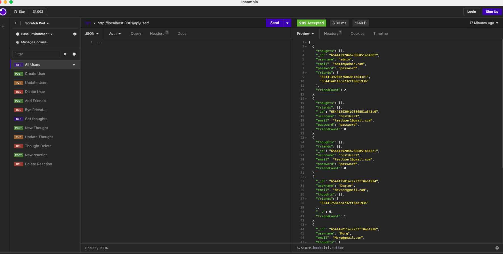

# social_network_api

  ## Table of Contents
  *[Description](#description)  
  *[Installation](#Installation)  
  *[Usage](#usage)  
  *[Contribution](#contribution)  
  *[Tests](#tests)  
  *[Questions](#questions)  
  *[Credits](#credits)  

  ## Description 
  This application keeps track of users along with their posts and reactions to other user's posts. 

  ## Installation 
  express, dayjs, and mongoose were used to create this application

  ## Usage 
  When "npm start" is entered in the command line, it will start the application and able to test end points of users, thoughts as well as reactions. You will be able to see how many thoughts a certain user has posted since creating their account. You can delete thoughts and reactions from the database as well. 
  

  ## Licenses 
  
  This project is using the MIT license. To learn more, please click the license link listed above.

  ## Contribution 
  I had to reference youtube videos to see how routes and objects were used with one another to have established relationships and able to store the data.

  ## Tests 
  N/a

  ## Questions 
  Have any questions regarding this project?  
  Send me a message on...  
  Github: https://github.com/gabe-velasquez  
  Email: gabriel.velasquez0116@gmail.com  

  ## Credits 
  Gabe Velasquez
